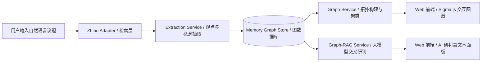

<div align="center">

# 🌟 知辨 ZhiBian (Graph-RAG Engine)

**将知乎高赞回答与多元争议，结构化解析为可交互探索的观点知识网络**

[](https://react.dev/)
[](https://www.typescriptlang.org/)
[](https://tailwindcss.com/)
[](https://ai.google.dev/)
[](https://opensource.org/licenses/MIT)

<p align="center">
  <a href="#-核心特性">核心特性</a> •
  <a href="#-系统架构">系统架构</a> •
  <a href="#-快速开始">快速开始</a> •
  <a href="#-核心技术栈">技术栈</a> •
  <a href="#-项目结构">目录结构</a> •
  <a href="#-环境变量说明">环境变量</a>
</p>

</div>

---

## 📖 项目简介

**知辨（ZhiBian）** 是一款面向复杂社会议题、职业规划与技术趋势决策的 **Graph-RAG（图检索增强生成）观点研判系统**。

在面对 *“AI对普通人的影响”、“大学生要不要考研”、“一线买房还是回老家”* 等多元议题时，网络问答平台往往充斥着海量碎片化、立场冲突的长篇回答。**知辨** 通过大模型与知识抽取技术，从知乎全网高赞回答中自动提取**核心论点、证据链、支撑论据与争议焦点**，将其组织为拓扑关系图谱，并结合 **Graph-RAG 引擎** 生成带有精准可信出处的结构化研判报告。

---

## ✨ 核心特性

### 1. 🕸️ 交互式力导向知识图谱 (Interactive Graph Canvas)
- **多维度拓扑呈现**：中心议题节点 $\rightarrow$ 答主立场节点 $\rightarrow$ 核心论据与争议概念。
- **共识观点聚类**：自动合并具有相似论点的答主，展示「多方合并不谋而合」的共识枢纽。
- **流畅物理仿真**：采用 ForceAtlas2 与 Graphology 动力学布局，支持缩放、拖拽聚焦、图谱全屏及暗黑星系/明亮主题切换。

### 2. 🤖 Graph-RAG 智能交叉研判 (Graph-RAG AI Chat)
- **精准证据回溯**：回答基于图谱拓扑与结构化论点生成，行文标注 `[1]`, `[2]` 来源序号。
- **多方立场客观拆解**：自动归纳 **🟢 积极/赋能**、**🔴 审慎/风险**、**🟡 务实/条件** 等多元视角。
- **富文本排版与一键复制**：全面支持 Markdown 结构化渲染，支持一键导出研判简报。
- **图谱双向联动**：点击研判报告底部的引用卡片，即可高亮并平移定位至知识图谱对应答主节点。

### 3. 📑 结构化精读与多维筛选 (Structured Answer Panel)
- **自动摘要提取**：提炼每位高赞答主的 1 句话核心论点与关键标签（如 `#效率提升`、`#替代风险`）。
- **动态过滤**：支持按最低点赞阈值、核心概念标签进行实时图谱剪枝与卡片检索。

---

## 🏗️ 系统架构



---

## 🚀 快速开始

### 1. 环境要求
- [Node.js](https://nodejs.org/) (v18.0.0 或更高版本)
- [npm](https://www.npmjs.com/) 或 [pnpm](https://pnpm.io/)

### 2. 克隆项目与安装依赖

```bash
# 克隆仓库
git clone https://github.com/your-username/zhihu-graph-rag.git
cd zhihu-graph-rag

# 安装项目依赖
npm install
```

### 3. 配置环境变量

在项目根目录下创建 `.env` 文件（或参考 `.env.example`）：

```env
# Google Gemini API Key（用于高阶观点抽取与 Graph-RAG 智能研判）
GEMINI_API_KEY=your_gemini_api_key_here

# （可选）知乎实时数据抓取凭证
ZHIHU_ACCESS_SECRET=
```

> 💡 **提示**：若未配置 `GEMINI_API_KEY`，系统将自动无缝降级至内置的高质量离线拓扑抽取与确定性研判引擎，所有核心功能均可正常体验。

### 4. 启动本地开发服务

```bash
npm run dev
```

启动后在浏览器中访问：`http://localhost:3000`

### 5. 构建与生产部署

```bash
# 编译前端静态资源与后端服务端 Bundle
npm run build

# 启动生产服务
npm start
```

---

## 🛠️ 核心技术栈

| 模块 | 技术选型 | 说明 |
| :--- | :--- | :--- |
| **前端框架** | React 19 + TypeScript + Vite | 现代化高效客户端渲染与响应式状态管理 |
| **样式与动效** | Tailwind CSS v4 + Motion | 精致的高对比度现代界面与流畅交互体验 |
| **图谱可视化** | Sigma.js + Graphology + D3.js | 高性能 Canvas/WebGL 力导向关系网络渲染 |
| **AI 与 RAG** | Google GenAI SDK (`@google/genai`) | Gemini 多模态推理、观点提取与结构化生成 |
| **Markdown 渲染** | React-Markdown | 优雅的研判报告排版、代码标签与引用组件 |
| **后端服务** | Node.js + Express + ESBuild | 全栈 RESTful 接口与拓扑关系图处理管道 |

---

## 📂 项目结构

```text
├── fixtures/                  # 预置高质量基准测试与答主样本数据
├── src/
│   ├── client/               # 前端代码
│   │   ├── components/       # 核心 UI 组件
│   │   │   ├── AIChatPanel.tsx    # Graph-RAG AI 智能研判与对话面板
│   │   │   ├── AnswerList.tsx     # 左侧精选高赞回答与筛选列表
│   │   │   └── GraphCanvas.tsx    # 中心拓扑关系知识图谱画布
│   │   ├── store/            # 全局 Zustand 状态管理
│   │   ├── App.tsx           # 主布局入口
│   │   └── main.tsx          # 前端挂载入口
│   ├── server/               # 后端服务
│   │   ├── api/              # Express API 路由层 (/api/queries/*)
│   │   ├── db/               # 内存图数据存储与索引引擎
│   │   └── services/         # 核心业务服务
│   │       ├── extraction.ts      # 观点抽取与立场判别服务
│   │       ├── graph-rag.ts       # Graph-RAG 拓扑增强问答服务
│   │       ├── graph-service.ts   # 图谱节点与边生成算法
│   │       ├── ingestion.ts       # 流水线任务调度
│   │       └── zhihu-adapter.ts   # 知乎搜索与数据适配层
│   └── shared/               # 前后端共享 TypeScript 类型定义 (models.ts)
├── server.ts                 # Express 服务端主入口与 Vite 中间件
├── package.json              # 项目依赖与运行脚本
└── README.md                 # 项目说明文档
```

---

## 🤝 参与贡献

欢迎提交 Issue 和 Pull Request 来帮助完善知辨！

1. Fork 本仓库
2. 创建您的特性分支 (`git checkout -b feature/AmazingFeature`)
3. 提交您的修改 (`git commit -m 'feat: Add some AmazingFeature'`)
4. 推送到分支 (`git push origin feature/AmazingFeature`)
5. 开启一个 Pull Request

---

## 📄 开源许可证

本项目基于 [MIT License](LICENSE) 开源。
